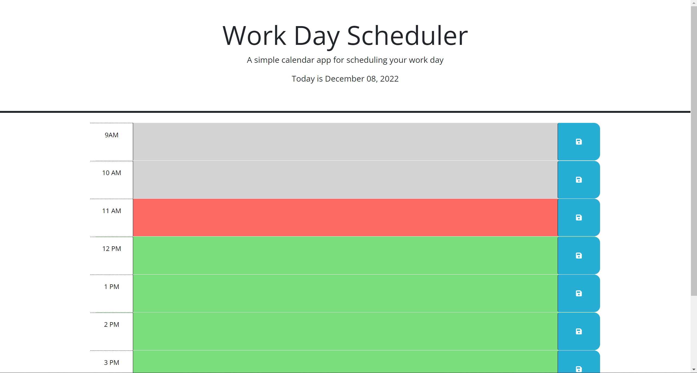

# work-day-scheduler

## Description

Type in your schedule and save so you can access the same information later.

## Table of Contents

- [Installation](#installation)
- [Usage](#usage)
- [Credits](#credits)
- [License](#license)

## Installation

You can reach this webpage through any web browser. No installation is required.
https://azimezn.github.io/work-day-scheduler/

## Usage

Type in any time block and click the save button to save your schedule so you can access the information again. The times are color coded to show which times are in the past, present, or future.

## Credits

- Rutgers University Coding Bootcamp
- [w3schools.com](W3schools.com)

## License

N/A
